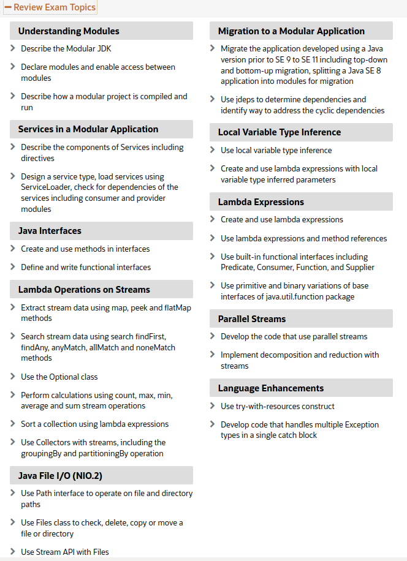

# Java 11 upgrade (from 6,7,8) certification study guide

This repository covers all the topics from [Upgrade OCP Java 6, 7 & 8 to Java SE 11 Developer | 1Z0-817](https://education.oracle.com/upgrade-ocp-java-6-7-8-to-java-se-11-developer/pexam_1Z0-817) topics.

## Repository distribution

Each repository topic is stored in a separate directory along with a README and a checklist with explanation for each item.
More than one topic can be grouped into the a common directory.
Here's a list of directories and topics covered:

### `co.brunoleite.modules`
- `Understanding Modules`
- `Services in a modular application`
- `Migration to a modular application` 

